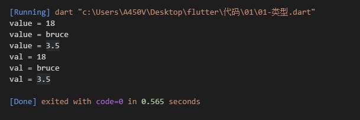
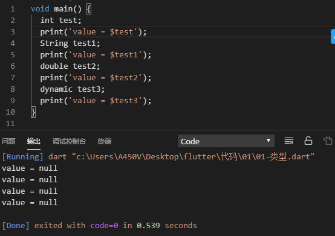

# Dart

## 0. Flutter是什么？

> Flutter是Google一个新的用于**构建跨平台**的手机App的SDK（Software Development Kit）。写一份代码，在Android 和iOS平台上都可以运行。

### 1. 跟React Native、Weex等有什么不同？

React Native、Weex等一直存在一个问题，就是性能跟原生App存在很大的差异。这跟它们的原理有很大的关系，下面从原生App，RN、Weex，Flutter的简单原理说一下它们的不同。

- 原生App
   苹果2008年发布iOS，Google 2009年发布Android，它们的SDK是基于两种不同的编程语言Objective-C 和 Java。现在又有了Swift和Kotlin。

  

  上面是原生App的一个简单架构，开发人员直接调用平台SDK进行UI开发。由于语言及SDK的不同，所以开发人员必须为两个平台分别开发App。

- WebViews
   最早的跨平台方案是基于JavaScript 和 WebView的，像PhoneGap、Cordova、Ionic等。

  

  UI通过WebView来显示html代码，系统服务则通过一个中间层桥接到JavaScript中去。

- React Native
   RN不仅桥接系统服务，也将系统UI也桥接到了JavaScript中，这样写出来的UI最终也会渲染成原生的控件。

  

  如上图这样，UI的渲染是很频繁的，要使UI不卡顿，必须达到60Fps。但是桥接会花一定的时间。所以这样的架构有时候会有性能问题。

- Flutter,  
   Flutter使用Dart语言开发，Dart可以被编译（AOT:ahead of time）成不同平台的机器代码，让Flutter可以直接和平台通讯而不需要一个中间的桥接过程，从而提高了性能。

- javascript(JIT:just in time)

  

  

## 1. 重要概念

学习**Dart**之前，先要了解以下Dart相关的概念：

> 1. 能够放在**变量中的所有内容都是对象**，每个对象都是一个类的实例。甚至于数字、函数和null值都是对象，并且**所有对象都继承自Object类**。
> 2. Dart是**强类型语言**，但类型标识是可选的，因为Dart可以推断类型。如果要明确说明不需要任何类型，可以使用特殊类型dynamic标识。
> 3. Dart支持**泛型**，如List（任何类型的对象列表）
> 4. Dart支持**顶级函数**（例如main函数），以及绑定到类或对象的函数（分别是**静态方法**和**实例方法**）。**函数内部也可以创建函数**（嵌套函数或本地函数）
> 5. Dart支持**顶级变量**，以及绑定到类或对象的变量（分别是**静态变量**和**实例变量**）。
> 6. 与Java不同，**Dart没有关键字public、protected和private**。如想设置私有变量或函数，则变量和函数名以**下划线（_）开头**。
> 7. Dart有两个表达式（具有运行时值）和语句（不具有）。 例如，**条件表达式条件？ expr1：expr2的值为expr1或expr2**。 将其与if-else语句进行比较，该语句没有任何值。 语句通常包含一个或多个表达式，但表达式不能直接包含语句。
> 8. Dart工具可以报告两种问题：警告和错误。警告只是表明您的代码可能无法正常工作，但它们不会阻止您的程序执行。 错误可以是编译时或运行时。 编译时错误会阻止代码执行; 运行时错误导致代码执行时引发异常。


## 2. 基础数据类型

### 1. 变量的定义

可以使用var来定义变量，变量的类型可以使用变量值推断出来，也可以使用特定类型来定义变量

```dart
// var/dynamic/const/final 变量名称 = 赋值;
var name = "hi"; //String类型
var age = 18; //int类型
var high = 1.70; //double类型

// 变量类型 变量名称 = 赋值;
String name = "hi"; // String类型
int age = 18; // int类型
```


如上变量定义后其类型已经确定，不可再将其他类型的值赋给变量

```dart
var name = "3"; //String类型
name = 3; //此处编译器会报错，name被定义赋值之后已经是一个String类型，不可再赋值int类型值
```

如果变量不限于单个类型，则可以使用dynamic或Object来定义变量

```dart
dynamic value = 18;
print("value = $value");
value = "bruce";
print("value = $value");
value = 3.5;
print("value = $value");
  
Object val = 18;
print("val = $val");
val = "bruce";
print("val = $val");
val = 3.5;
print("val = $val");
```

输出结果：




**final 和 const**

final和const都是用作定义常量的， 也就是说定义后不能修改

```dart
final name = '张三';
name = '李四'; // 提示错误

const age = 12;
age = 13; // 提示错误
```

那么final和const有什么区别呢？

- const在赋值时，赋值内容必须是编译期间就能确定下来的
- final是可以动态获取的，比如赋值一个函数

```dart
void main() {
  int a = 1;
  int b = 2;
  // a = 3; // a可以重新赋值
  final c1 = a * b;
  const c2 = a * b; // 提示错误，因为a和b并不是使用const定义的
  final t1 = test();
  const t2 = test(); // 提示错误
}

// 定义test函数
void test() {
  print('test 方法');
}
```


**注意：**

> 如果一个变量没有初始化值，那么它的默认值为null




### 2. 内置类型

> **Numbers（数值）:**  包含**int**和**double**两种类型，没有像Java中的float类型，int和double都是num的子类型。
>
> **Strings（字符串）:** 可以使用单引号或者双引号来创建字符串。
>
> **Booleans（布尔值）**：Dart有一个名为bool的类型，只有两个对象具有bool类型：true和false，他们都是编译时常量。
>
> **List（列表）: **在 Dart 中**数组**就是 [List](https://api.dartlang.org/stable/dart-core/List-class.html) 对象。
>
> **Map（键值对象）：**Map 是一个键值对相关的对象。
>
> **Runes：**runes 代表字符串的 UTF-32 code points。
>
> **Symbols：**一个 [Symbol](https://api.dartlang.org/stable/dart-core/Symbol-class.html) object 代表 Dart 程序中声明的操作符或者标识符。


### 3. 数字类型

> 对于数字类型，只需要知道整数用`int`， 浮点数用`double`

```dart
// 1. 整数类型int
int age = 18;
double h = 1.77;
print('$age , $h');

// 输出结果
// 18 , 1.77
```

#### 1. 转换类型

```dart
// 1. 字符串转换数字
var str = int.parse('123');
var str1 = double.parse('123.22');
print('$str, ${str.runtimeType}; $str1, ${str1.runtimeType}');


// 2. 数字转字符串
var str2 = 123.toString();
var str3 = 123.44.toString();
print('$str2, ${str2.runtimeType}; $str3, ${str3.runtimeType}');
```

#### 2. 运算符

```dart
var num = 5;
print(num / 3); // 除法操作, 结果1.6666..
print(num ~/ 3); // 整除操作, 结果1;
print(num % 3); // 取模操作, 结果2;
```


### 4. 布尔类型

布尔类型中,Dart提供了一个bool的类型, 取值为true和false

```dart
// 布尔类型
var isBool = true;
print('$isBool ${isBool.runtimeType}');
```

**注意: Dart中不能判断非0即真, 或者非空即真**


### 5. 字符串

您可以使用单引号或双引号创建一个字符串:

```dart
// 1.定义字符串的方式
var s1 = 'Hello World';
var s2 = "Hello Dart";
var s3 = 'Hello\'Fullter';
var s4 = "Hello'Fullter";


// 2.表示多行字符串的方式
var message1 = '''
哈哈哈
呵呵呵
嘿嘿嘿''';
```

#### 1. ??=赋值操作

Dart里面的`??=`赋值操作；

- 如果变量的值为null，则使用右侧的值进行赋值；
- 如果变量的值不为null，则保持原有的值，不会进行赋值操作；

```dart
void main() {
  var name1 = '张三';
  print(name1);
  // var name2 = '王五';
  var name2 = null;
  name2 ??= '李四';
  print(name2); 
}
```


#### 2. ??条件运算符

`expr1 ?? expr2`

- 如果`expr1`是`null`,则返回`expr2`的值；
- 如果`expr1`不是`null`, 则使用`expr1`的值；

```dart
void main() {
  var name1 = '张三';
  var name2 = null;
  name2 = '李四' ?? name1;
  print(name2);
}
```


### 6. List、Set、Map

#### 1. 定义

定义`List`:

```dart
// List定义
// 1.使用类型推导定义
var lists = ['a', 'b', 'c', 'd'];
print('$lists ${lists.runtimeType}  ${lists.length}');

// 2.明确指定类型
List<int> nums = [1, 2, 3, 4];
print('$nums ${nums.runtimeType}  ${nums.length}');
```

定义`Set`:

```dart
// Set的定义
// 1.使用类型推导定义
var listsSet = {'a', 'b', 'c', 'd'};
print('$listsSet ${listsSet.runtimeType}  ${listsSet.length}');

// 2.明确指定类型
Set<int> numsSet = {1, 2, 3, 4};
print('$numsSet ${numsSet.runtimeType}  ${numsSet.length}');
```

**`Set` 和 `List`最大的不同就是：`Set`是无序的，并且元素是不重复的**

定义`Map`：

```dart
// Map的定义
// 1.使用类型推导定义
var map1 = {'name': '张三', 'age': 18};
print('$map1 ${map1.runtimeType}  ${map1.length}');

// 2.明确指定类型
Map<String, Object> map2 = {'height': 1.78, 'address': '广州市'};
print('$map2 ${map2.runtimeType}  ${map2.length}');
```


#### 2. 操作

添加/删除/包含操作

```dart
  // 数组的添加、删除、包含操作
  var lists = ['a', 'b', 'c', 'd', 'a'];

  // 添加元素 
  lists.add('e');

  // 添加元素
  lists.addAll(['ddd', 'eee', 'aaa']);

  // 删除元素
  lists.remove('a');

  // 根据下标删除元素
  lists.removeAt(3);
  print('$lists ${lists.runtimeType} ${lists.length} ${lists.contains('aaa')}');

  // Set的添加、删除、包含操作
  var listsSet = {'a', 'b', 'c', 'ddd'};

  // 添加
  listsSet.add('e');

  // 添加
  listsSet.addAll({'ddd', 'eee', 'aaa'});

  // 删除元素
  listsSet.remove('ddd');
  print('$listsSet ${listsSet.runtimeType} ${listsSet.length} ${listsSet.contains('aaa')}');

   // Map的操作
  var map1 = {'name': '张三', 'age': 18};
  print('$map1 ${map1.runtimeType} ${map1.length}');
  // 根据key获取value
  print(map1['name']); // 张三

  // 获取所有的keys
  print('${map1.keys} ${map1.keys.runtimeType}');

  // 获取所有的values
  print('${map1.values} ${map1.values.runtimeType}');

  // 获取所有的values
  print('${map1.containsKey('age')} ${map1.containsValue(18)}');

  // 根据key删除元素
  map1.remove('age');
  print('${map1}');
```


### 7. 函数

Dart是一种真正的面向对象语言，所以即使函数也是对象，所有也有类型, 类型就是Function。这也就意味着函数可以作为变量定义或者作为其他函数的参数或者返回值。

定义：

```dart
/*
返回值 函数的名称(参数列表) {
  函数体
  return 返回值
}
*/
// 普通的函数定义
String getStr(String str) {
  return str;
}
// 箭头函数定义
String getStr(String str) => str;
```


#### 1. 可选参数

**命名可选参数**

```dart
// 命名可选参数
void user(String name, {int age, String sex}){
  print('$name, $age, $sex');
}

void main() {
  user('张三'); // 张三, null, null
  user('张三', age: 12); // 张三, 12, null
  user('张三', sex: '男', age: 20); // 张三, 20, 男 
}

```

**定义位置可选参数**

```dart
void user(String name, [int age, String sex]){
  print('$name, $age, $sex');
}
void main() {
  user('张三'); // 张三, null, null
  user('张三', null, '男'); // 张三, null, 男
  user('张三', 12); // 张三, 12, null
}
```

**注意：**

1. 将函数赋值给一个变量, 也可以将函数作为另外一个函数的参数或者返回值来使用


#### 2. 作用域

dart中的词法有自己明确的作用域范围，它是根据代码的结构({})来决定作用域范围的；优先使用自己作用域中的变量，如果没有找到，则一层层向外查找。

```dart
var name = '3';
void main() {
  // var name = '2';
  void test() {
    // var name = '1';
    print(name);
  }
  test();
}
```


#### 3. 词法闭包

闭包可以访问其词法范围内的变量，即使函数在其他地方被使用，也可以正常的访问。

```dart
void main() {
  test(int a) {
    return (int b) {
      return a + b;
    };
  }
  // print(test(3)(4));
  var test1 = test(3);
  print(test1(4));
  print(test1(7));
}
```


#### 4. 返回值问题

所有函数都返回一个值。如果没有指定返回值，则语句返回`null`;隐式附加到函数体。


