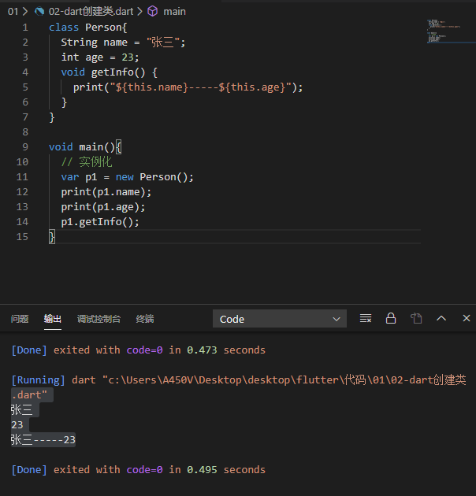

## 1. 面向对象入门

### 1. 类的定义

> 面向对象编程（OOP）三个特征：封装、继承、多态
>
> 封装：封装是对象和类概念的主要特征。封装，把客观事物封装成抽象类，并且把自己的部分属性和方法提供给其他对象使用。
>
> 继承：面向对象编程语言的一个主要功能。继承是**类与类的一种关系**，子类拥有父类的所有属性和方法，从而实现了**代码的复用**。
>
> 多态：父类定义一个方法不去实现，让继承它的子类去实现，每个子类有不同的表现

Dart 是一个面向对象编程语言，定义类用`class`关键字。类通常由两部分组成：成员（member）和方法（method）。

**自定义类**

```dart
class Person{
  String name = "张三";
  int age = 23;
  void getInfo() {
    print("${this.name}-----${this.age}");
  }
    
  void setInfo(int age) {
      this.age = age;
  }
}

void main(){
  // 实例化
  var p1 = new Person(); // 除了var 还可以用Person
  print(p1.name);
  print(p1.age);
  p1.getInfo();
  p1.setInfo(10);
  print(p1.age); // 10
}
```




### 2. 构造函数

> 如果想创建一个Person类，并且创建的时候才确定姓名和年龄，那要怎么做呢？
>
> 这时候就需要用到构造函数

#### 1.  默认构造函数

```dart
class Person {
  String name;
  int age;
  
  // 默认构造函数
  // Person(String name, int age){
  //   this.name = name;
  //   this.age = age;
  // }
  // 上面可以简写成下面这种形式
  Person(this.name, this.age);

  void getInfo() {
    print("${this.name}-----${this.age}");
  }

  void setInfo(int age) {
    this.age = age;
  }
}

void main() {
  // 实例化
  Person p1 = new Person('张三', 10);
  p1.getInfo();

  Person p2 = new Person('李四', 19);
  p2.getInfo();
}

```


#### 2. 命名构造函数

```dart
class Person {
  String name;
  int age;

  // Person(String name, int age){
  //   this.name = name;
  //   this.age = age;
  // }
  Person(this.name, this.age);

  Person.now(){
    print('我是命名构造函数');
  }

  void getInfo() {
    print("${this.name}-----${this.age}");
  }

  void setInfo(int age) {
    this.age = age;
  }
}

void main() {
  // 实例化
  Person p1 = new Person('张三', 10);
  p1.getInfo();
  
  Person p2 = new Person.now();
  // p2.getInfo();

  var d = DateTime.now(); // 实例化DateTime调用它的命名构造函数
  print(d);
}

```

#### 3. 抽离类

> 如果我们把所有的类都写在一个文件里，这个文件会越来越大，而且不好维护，所以我们可以把类抽离出来，放到单独的文件里面去

在lib目录下创建**Animal.dart**和**Person.dart**两个文件：


Animal.dart

```dart
class Animal {
  String name;
  int age;
  Animal(this.name, this.age);

  Animal.now(){
    print('我是命名构造函数');
  }

  void getInfo() {
    print("${this.name}-----${this.age}");
  }

  void setInfo(int age) {
    this.age = age;
  }
}
```

Person.dart

```dart
class Person {
  String name;
  int age;
  Person(this.name, this.age);

  Person.now(){
    print('我是命名构造函数');
  }

  void getInfo() {
    print("${this.name}-----${this.age}");
  }

  void setInfo(int age) {
    this.age = age;
  }
}
```

主文件：

```dart
import './lib/Person.dart';
import './lib/Animal.dart';

void main() {
  // 实例化Person
  Person p1 = new Person('张三', 10);
  p1.getInfo();

  // 实例化Animal
  Animal a1 = new Animal('小猫', 1);
  a1.getInfo();
}
```


### 3. 类里面定义私有属性和私有方法

> **Dart**和其他面向对象语言不一样，**Dart**中没有`public` `private` `protected`这些访问修饰符
>
> 但是我们可以使用_把属性或者方法定义成私有

```dart
// lib/Animal
class Animal {
  String _name;
  int age;
  Animal(this._name, this.age);

  Animal.now(){
    print('我是命名构造函数');
  }

  void getInfo() {
    print("${this._name}-----${this.age}");
  }

  void setInfo(int age) {
    this.age = age;
  }

  int _getAge() {
    return this.age;
  }
  
  int getAge() {
    return this._getAge();
  }

}
```

```dart
import './lib/Animal.dart';

void main() {
  // 实例化
  Animal a1 = Animal('小狗', 1);
  // print(a1._name); // 报错
  a1.getInfo();

  // a1._getAge();// 报错
  a1.getInfo();
}
```


### 4. 类中的初始化列表

```dart
void main() {
  Rect r1 = new Rect();
  print(r1.getArea());
}

class Rect {
  int width;
  int height;

  Rect():width=20,height=10{ // 可以在构造函数执行前初始化赋值
    print('${this.height}---------');
  }

  int getArea() {
    return this.height * this.width;
  }
}

```


## 2. 面向对象进阶一

### 1. 静态成员和方法

```dart
/*
  Dart中的静态成员：
  1. 使用static 关键字来实现类级别的变量和函数；
  2. 静态方法不能访问非静态成员，非静态方法可以访问静态成员；
*/

void main() {
  // 访问类里面的静态成员
  print('${Person.name}');
  print('-----------');

  // 访问类里的静态方法
  Person.showName();
  print('-----------');

  // 通过非静态方法访问静态方法
  Person p1 = new Person();
  p1.showNamePulic();
}

class Person{
  int age = 11;
  static String name = '张三';
  static void showName() {
    print(name);
    // print(age); // 静态方法不能访问非静态的变量
  }
  void showNamePulic() {
    print(age);
    showName();
  }
}
```


### 2. 对象操作符

```dart
/*
  Dart中的对象操作符：
    ?     条件运算符 （了解）
    is    类型判断
    ..    级联操作    (重点)
*/

void main() {

  print('-------?-------');
  Person p1;
  p1?.showNamePulic();

  print('-------is-------');
  Person p2 = new Person('张三', 18);
  if (p2 is Person) {
    p2.name = '李四';
  }
  p2.showNamePulic();

  print(p2 is Object);

  print('-------..-------');
  Person p4 = new Person('张三1', 28);
  p4.showNamePulic();
  // p4.name = '李四1';
  // p4.age = 20;
  // p4.showNamePulic();
  // 上面的可以通过级联操作
  p4..name = '李四1'
    ..age = 20
    ..showNamePulic();
}

class Person{
  int age;
  String name;

  Person(this.name, this.age);
  
  void showNamePulic() {
    print('$name ------- $age');
  }
}
```


### 3. 继承

> Dart中的对象继承：
>
> ​    1. 子类通过extends关键字来继承父类
>
> ​    2. 子类会继承父类里面可见的属性和方法 但不会继承构造函数
>
> 3. 子类能够复写父类的方法


#### 1. 简单继承

```dart
void main() {
  Male m1 = new Male();
  m1.show();
}

class Person{
  int age = 20;
  String name = '张三';
  
  void show() {
    print('$name ------- $age');
  }
}

class Male extends Person {
  
}
```


#### 2. super关键字的使用

```dart
void main() {
  Male m1 = new Male('张三', 10);
  m1.show();
}

class Person{
  int age;
  String name;
  
  // 构造函数
  Person(this.name, this.age);

  void show() {
    print('$name ------- $age');
  }
}

class Male extends Person {
  Male(String name, int age) : super(name, age);
}
```


#### 3. 重写父类方法

```dart
void main() {
  Male m1 = new Male('张三', 10);
  // m1.show();

  m1.run();
}

class Person{
  int age;
  String name;
  
  // 构造函数
  Person(this.name, this.age);

  void show() {
    print('$name ------- $age');
  }
}

class Male extends Person {
  Male(String name, int age) : super(name, age);

  // 子类复写父类方法
  @override
  show() {
    print('姓名：${name}----- 年龄：${age}');
  }

  run() {
    super.show();
  }
}
```


### 4. 抽象类

> Dart中的抽象类，用于定义标准，子类可以继承抽象类，也可以用抽象类实现接口：
>
> ​    1. Dart中抽象类没有方法体的方法我们称为抽象类（abstract）
>
> ​    2. 如果子类继承抽象类必须得实现里面的**抽象类方法**
>
> ​    3. 如果把抽象类当作接口实现的话必须得实现抽象类里面定义的所有**属性和方法**
>
> 4. 抽象类不能实例化，只有继承它的子类可以
>
> **extends** 抽象类和**implements**抽象类的区别：
>
> 1. 如果要复用抽象类里面的方法，并且要用抽象方法约束类的话我们用extends继承抽象类
> 2. 如果只是把抽象类当作标准的话我们就用implements实现抽象类


```dart
/*
  定义一个Person类要求子类必须包含run方法
*/
void main() {
  Male m1 = new Male();
  m1.run();
  m1.sing();

  
  // Person p1 = new Person();// 抽象类没办法被实例化
}

abstract class Person{
  run(); // 抽象方法
  sing(); // 抽象方法
  printInfo() {
    print('抽象类里面的普通方法');
  }
}

class Male extends Person {
  @override
  run() {
    print('男孩正在跑步');
  }

  @override
  sing() {
    print('男孩正在唱歌');
  }
}

class Female extends Person {
  @override
  run() {
    print('女孩正在跑步');
  }

  @override
  sing() {
    print('女孩正在唱歌');
  }

}
```


### 5. 多态

> Dart 中的多态就是父类定义一个方法不去实现，让继承它的子类去实现，每个子类有不同的表现
>
> 上面的列子就是多态（多种状态）的例子


### 6. 接口

> 1. Dart中接口使用implements关键字进行实现；
> 2. Dart接口如果实现的类是普通类，会将普通类和抽象类中的属性和方法全部需要复写一遍；
> 3. 抽象类可以定义抽象方法，普通类不可以，所以一般如果要实现接口，一般使用抽象类；

```dart
void main() {
  MySql m1 = new MySql('xxxxx');
  m1.add('hhhhh');

  MongoDb m2 = new MongoDb('url');
  m2.add('ddddd');
}

abstract class Db {
  String url;
  add(String data);
  delete();
}

class MySql implements Db {
  @override
  add(String data) {
    print('mysql---add方法 ----$data');
  }

  @override
  delete() {
    print('mysql---delete方法');
  }

  @override
  String url;

  MySql(this.url);
}

class MongoDb implements Db{
  @override
  String url;

  MongoDb(this.url);

  @override
  add(String data) {
    print('mongo---add方法----$data');
  }

  @override
  delete() {
    print('mongo--delete方法');
  }

}
```

### 7. 实现多个接口

```dart
void main() {
  A a = new A();
  a.printB();
  a.printC();
}

abstract class B {
  printB();
}

abstract class C {
  printC();
}

class A implements B,C {
  @override
  printB() {
    print('printB');
  }

  @override
  printC() {
    print('printC');
  }
  
}
```


## 3. 面向对象进阶二

### 1.混入

> mixin混入：
>
> 1. Dart中可以使用mixin实现类似多继承的功能
> 2. 作为mixin的类只能继承自Object（dart里面的所有东西都是继承自Object），不能继承其他类（Person Male（extends Person））
> 3. 作为mixin的类不能有构造函数
> 4. 一个类可以mixin多个mixin类
> 5. mixin绝不是继承，也不是接口，而是一种全新的特征

```dart
void main() {
  A a = new A('19');
  a.printB();
  a.printC();
}

class D {
  String num;
  D(this.num);
}

class B {
  printB(){
    print('B');
  }
}

class C {
  // C(){} // mixins的类不能有构造函数
  printC(){
    print('C');
  }
}

class A extends D with B,C {
  A(String num) : super(num);
}
```


### 2. 泛型

> 简单理解：泛型就是解决类 接口 方法的复用性、以及对不特定数据类型的支持（类型校验）


```dart
// 这两个方法冗余
String getVal1(String value) {
  return value;
}

int getVal2(int value) {
  return value;
}

// 解决方式，不校验类型
getVal(value) {
  return value;
}

// 解决上面的缺陷
T getData<T>(T value) {
  return value;
}

void main() {
  print(getData('123'));
  print(getData(456));
  print(getData<String>('789'));
  
  List list = new List<String>();
  // list.add(123);// 错误
  list.add('123');
}
```


