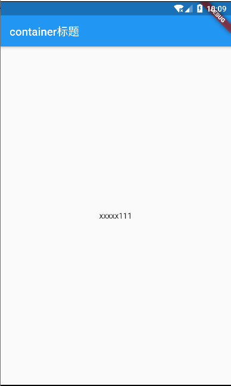
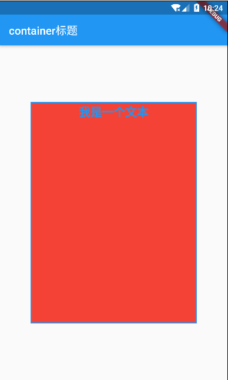
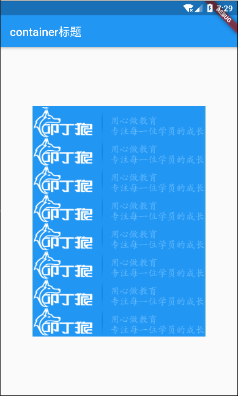
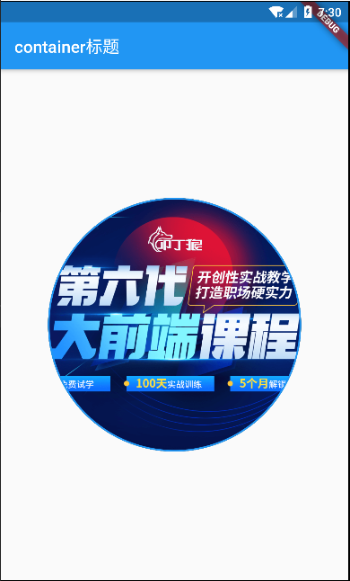
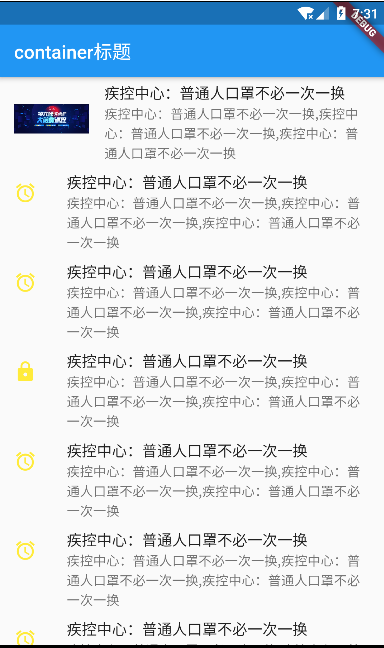
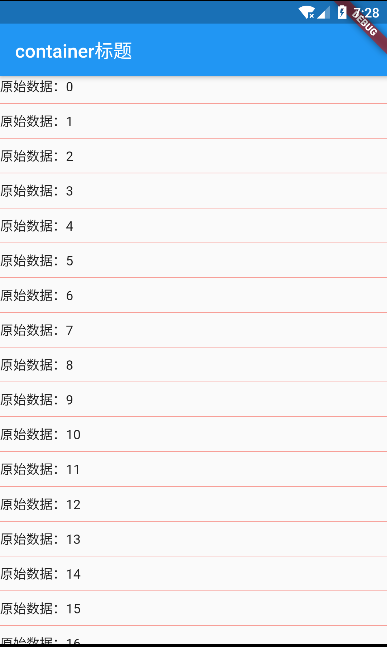

# flutter


## 1. 实现最简单的页面布局（MaterialApp，Scaffold，Center）

>  MaterialApp是基于Material Design设计风格的应用，一般作为Flutter应用的根元素。
>
>  Scaffold 翻译过来就是脚手架的意思，它实现了基本的 Material Design 可视化布局结构。  

```dart
import 'package:flutter/material.dart';

void main() => runApp(MyApp());

class MyApp extends StatelessWidget {
  const MyApp({Key key}) : super(key: key);

  @override
  Widget build(BuildContext context) {
    return MaterialApp(
      home: Scaffold(
        appBar: AppBar(
          title: Text('container标题'),
        ),
        body: Center(
          child: Text('xxxxx111'),
        ),
      ),
    );
  }
}

```

效果：




## 2. Container、Text例子

>  Container在Flutter中太常见了。官方给出的简介，是一个结合了绘制（painting）、定位（positioning）以及尺寸（sizing）widget的widget。 



```dart
import 'package:flutter/material.dart';

void main() => runApp(MyApp());

class MyApp extends StatelessWidget {
  const MyApp({Key key}) : super(key: key);

  @override
  Widget build(BuildContext context) {
    return MaterialApp(
      home: Scaffold(
        appBar: AppBar(
          title: Text('container标题'),
        ),
        body: HomeContent(),
      ),
    );
  }
}

class HomeContent extends StatelessWidget {
  const HomeContent({Key key}) : super(key: key);

  @override
  Widget build(BuildContext context) {
    return Center(
      child: Container(
        child: Text(
          '我是一个文本',
          textAlign: TextAlign.center, // 设置文字的对齐方式
          style: TextStyle( // 设置文字颜色、加粗、字体大小
            color: Colors.blue,
            fontSize: 21.0,
            fontWeight: FontWeight.bold
          ),
        ), // 设置Container容器内容
        width: 300.0, // 设置宽度
        height: 400.0, // 设置高度
        decoration: BoxDecoration(
            color: Colors.red, // 设置Container的背景颜色
            border: Border.all(
                // 设置边框的颜色和宽度
                color: Colors.blue,
                width: 2)),
      ),
    );
  }
}

```


## 3. 图片组件（Image）

fit属性：

BoxFit.fill: 全图显示，图片会被拉伸，并充满父容器。

BoxFit.container: 全图显示，显示原比例，会出现空隙。

BoxFit.cover: 显示可能拉伸，可能剪裁，充满整个容器

### 1. 加载网络图片



```dart
import 'package:flutter/material.dart';

void main() => runApp(MyApp());

class MyApp extends StatelessWidget {
  const MyApp({Key key}) : super(key: key);

  @override
  Widget build(BuildContext context) {
    return MaterialApp(
      home: Scaffold(
        appBar: AppBar(
          title: Text('container标题'),
        ),
        body: HomeContent(),
      ),
    );
  }
}

class HomeContent extends StatelessWidget {
  const HomeContent({Key key}) : super(key: key);

  @override
  Widget build(BuildContext context) {
    return Center(
      child: Container(
        child: Image.network(
          'http://www.wolfcode.cn/themes/simplebootx/Public/self/img/header_logo.png',// 加载网络图片
          alignment: Alignment.bottomRight,
          color: Colors.blue,
          colorBlendMode: BlendMode.color,
          fit: BoxFit.contain,
          repeat: ImageRepeat.repeat,
        ), // 设置Container容器内容
        width: 300.0, // 设置宽度
        height: 400.0, // 设置高度
        decoration: BoxDecoration(
          color: Colors.yellow, // 设置Container的背景颜色
          border: Border.all(
            // 设置边框的颜色和宽度
            color: Colors.blue,
            width: 2,
          ),
        ),
      ),
    );
  }
}

```


### 2. 实现圆形图片



**方式一：**

```dart
import 'package:flutter/material.dart';

void main() => runApp(MyApp());

class MyApp extends StatelessWidget {
  const MyApp({Key key}) : super(key: key);

  @override
  Widget build(BuildContext context) {
    return MaterialApp(
      home: Scaffold(
        appBar: AppBar(
          title: Text('container标题'),
        ),
        body: HomeContent(),
      ),
    );
  }
}

class HomeContent extends StatelessWidget {
  const HomeContent({Key key}) : super(key: key);

  @override
  Widget build(BuildContext context) {
    return Center(
      child: Container(
        width: 300.0, // 设置宽度
        height: 300.0, // 设置高度
        decoration: BoxDecoration(
          color: Colors.yellow, // 设置Container的背景颜色
          border: Border.all(
            // 设置边框的颜色和宽度
            color: Colors.blue,
            width: 2,
          ),
          borderRadius: BorderRadius.circular(150),
          image: DecorationImage(
            image: NetworkImage(
                'http://www.wolfcode.cn/themes/simplebootx/Public/self/h5zt20191107/img/banner/banner.png'),
            fit: BoxFit.cover,
          ),
        ),
      ),
    );
  }
}

```

**方式二：**

```dart
import 'package:flutter/material.dart';

void main() => runApp(MyApp());

class MyApp extends StatelessWidget {
  const MyApp({Key key}) : super(key: key);

  @override
  Widget build(BuildContext context) {
    return MaterialApp(
      home: Scaffold(
        appBar: AppBar(
          title: Text('container标题'),
        ),
        body: HomeContent(),
      ),
    );
  }
}

class HomeContent extends StatelessWidget {
  const HomeContent({Key key}) : super(key: key);

  @override
  Widget build(BuildContext context) {
    return Center(
      child: Container(
        child: ClipOval(
          child: Image.network(
            'http://www.wolfcode.cn/themes/simplebootx/Public/self/h5zt20191107/img/banner/banner.png',
            width: 300,
            height: 300,
            fit: BoxFit.cover,
          ),
        ),
      ),
    );
  }
}

```

### 3.加载本地图片

```dart
import 'package:flutter/material.dart';

void main() => runApp(MyApp());

class MyApp extends StatelessWidget {
  const MyApp({Key key}) : super(key: key);

  @override
  Widget build(BuildContext context) {
    return MaterialApp(
      home: Scaffold(
        appBar: AppBar(
          title: Text('container标题'),
        ),
        body: HomeContent(),
      ),
    );
  }
}

class HomeContent extends StatelessWidget {
  const HomeContent({Key key}) : super(key: key);

  @override
  Widget build(BuildContext context) {
    return Center(
      child: Container(
        width: 300.0, // 设置宽度
        height: 300.0, // 设置高度
        child: Image.asset('images/banner.png'),
      ),
    );
  }
}

```


## 4. 列表

### 1. 普通列表



```dart
import 'package:flutter/material.dart';

void main() => runApp(MyApp());

class MyApp extends StatelessWidget {
  const MyApp({Key key}) : super(key: key);

  @overrider
  Widget build(BuildContext context) {
    return MaterialApp(
      home: Scaffold(
        appBar: AppBar(
          title: Text('container标题'),
        ),
        body: HomeContent(),
      ),
    );
  }
}

class HomeContent extends StatelessWidget {
  const HomeContent({Key key}) : super(key: key);

  @override
  Widget build(BuildContext context) {
    return ListView(
      children: <Widget>[
        ListTile(
          leading: Image.network(
            'http://www.wolfcode.cn/themes/simplebootx/Public/self/h5zt20191107/img/banner/banner.png',
            width: 80,
            height: 80,
          ),
          title: Text('疾控中心：普通人口罩不必一次一换'),
          subtitle: Text('疾控中心：普通人口罩不必一次一换,疾控中心：普通人口罩不必一次一换,疾控中心：普通人口罩不必一次一换'),
        ),
        ListTile(
          leading: Icon(
            Icons.access_alarms,
            color: Colors.yellow,
          ),
          title: Text('疾控中心：普通人口罩不必一次一换'),
          subtitle: Text('疾控中心：普通人口罩不必一次一换,疾控中心：普通人口罩不必一次一换,疾控中心：普通人口罩不必一次一换'),
        ),
        ListTile(
          leading: Icon(
            Icons.access_alarms,
            color: Colors.yellow,
          ),
          title: Text('疾控中心：普通人口罩不必一次一换'),
          subtitle: Text('疾控中心：普通人口罩不必一次一换,疾控中心：普通人口罩不必一次一换,疾控中心：普通人口罩不必一次一换'),
        ),
        ListTile(
          leading: Icon(
            Icons.https,
            color: Colors.yellow,
          ),
          title: Text('疾控中心：普通人口罩不必一次一换'),
          subtitle: Text('疾控中心：普通人口罩不必一次一换,疾控中心：普通人口罩不必一次一换,疾控中心：普通人口罩不必一次一换'),
        ),
        ListTile(
          leading: Icon(
            Icons.access_alarms,
            color: Colors.yellow,
          ),
          title: Text('疾控中心：普通人口罩不必一次一换'),
          subtitle: Text('疾控中心：普通人口罩不必一次一换,疾控中心：普通人口罩不必一次一换,疾控中心：普通人口罩不必一次一换'),
        ),
        ListTile(
          leading: Icon(
            Icons.access_alarms,
            color: Colors.yellow,
          ),
          title: Text('疾控中心：普通人口罩不必一次一换'),
          subtitle: Text('疾控中心：普通人口罩不必一次一换,疾控中心：普通人口罩不必一次一换,疾控中心：普通人口罩不必一次一换'),
        ),
        ListTile(
          leading: Icon(
            Icons.access_alarms,
            color: Colors.yellow,
          ),
          title: Text('疾控中心：普通人口罩不必一次一换'),
          subtitle: Text('疾控中心：普通人口罩不必一次一换,疾控中心：普通人口罩不必一次一换,疾控中心：普通人口罩不必一次一换'),
        ),
        ListTile(
          leading: Icon(
            Icons.home,
            color: Colors.yellow,
          ),
          title: Text('疾控中心：普通人口罩不必一次一换'),
          subtitle: Text('疾控中心：普通人口罩不必一次一换,疾控中心：普通人口罩不必一次一换,疾控中心：普通人口罩不必一次一换'),
        ),
        ListTile(
          leading: Icon(
            Icons.hotel,
            color: Colors.yellow,
          ),
          title: Text('疾控中心：普通人口罩不必一次一换'),
          subtitle: Text('疾控中心：普通人口罩不必一次一换,疾控中心：普通人口罩不必一次一换,疾控中心：普通人口罩不必一次一换'),
        ),
      ],
    );
  }
}

```

### 2. 下拉刷新，上拉加载更多



```dart
import 'dart:async';

import 'package:flutter/material.dart';

void main() => runApp(MyApp());

class MyApp extends StatelessWidget {
  const MyApp({Key key}) : super(key: key);

  @override
  Widget build(BuildContext context) {
    return MaterialApp(
      home: Scaffold(
        appBar: AppBar(
          title: Text('container标题'),
        ),
        body: HomeContent(),
      ),
    );
  }
}

class HomeContent extends StatefulWidget {
  HomeContent({Key key}) : super(key: key);

  @override
  _HomeContentState createState() => _HomeContentState();
}

class _HomeContentState extends State<HomeContent> {
  List list = new List();
  ScrollController _controller = new ScrollController();

  // 下拉刷新方法,为list重新赋值
    Future<void> _refreshData() async {
    return await Future.delayed(Duration(seconds: 3), () {
      setState(() {
        list = List.generate(
          20,
          (index) {
            return '我是刷新的数据：$index';
          },
        );
      });
      print('下拉结束');
    });
  }

  // 初始化数据
  @override
  void initState() {
    super.initState();
    _controller.addListener(() {
      ///判断当前滑动位置是不是到达底部，触发加载更多回调
      // print('${_controller.position.pixels}---${_controller.position.maxScrollExtent}');
      if (_controller.position.pixels == _controller.position.maxScrollExtent) {
        setState(() {
          list.addAll(List.generate(10, (index) {
            return '上拉加载的数据：${list.length + index }';
          }));
        });
      }
    });
    setState(() {
      list = List.generate(25, (index) {
        return '原始数据：$index';
      });
    });
  }

  @override
  void dispose() {
    _controller.dispose();
    super.dispose();
  }

  @override
  Widget build(BuildContext context) {
    return Container(
      child: RefreshIndicator(
        onRefresh: () => _refreshData(),
        child: ListView.separated(
          itemBuilder: (content, index) {
            print(index);
            return Container(
              child: Text(list[index]),
            );
          },
          controller: _controller,
          separatorBuilder: (content, index) {
            return Divider(
              color: Colors.red,
            );
          },
          itemCount: list.length,
        ),
      ),
    );
  }
}

```


