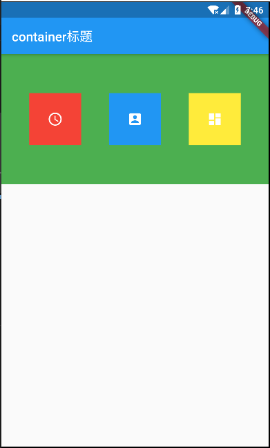
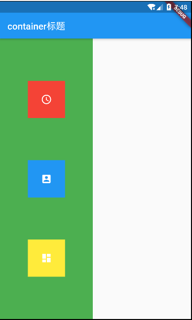
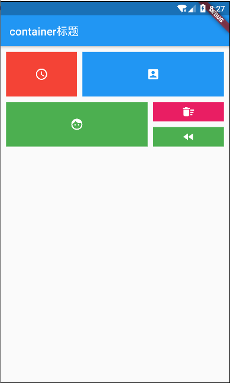
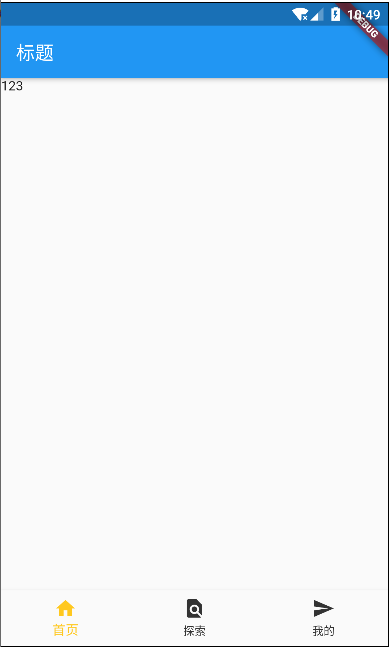

## 1. Row Column Expanded



```dart
import 'package:flutter/material.dart';

void main() => runApp(MyApp());

class MyApp extends StatelessWidget {
  const MyApp({Key key}) : super(key: key);

  @override
  Widget build(BuildContext context) {
    return MaterialApp(
      home: Scaffold(
        appBar: AppBar(
          title: Text('container标题'),
        ),
        body: HomeContent(),
      ),
    );
  }
}

class HomeContent extends StatelessWidget {
  const HomeContent({Key key}) : super(key: key);

  @override
  Widget build(BuildContext context) {
    return Container(
      height: 200,
      color: Colors.green,
      child: Row(
        mainAxisAlignment: MainAxisAlignment.spaceEvenly,
        children: <Widget>[
          IconContainer(Colors.red, Icons.access_time),
          IconContainer(Colors.blue, Icons.account_box),
          IconContainer(Colors.yellow, Icons.dashboard),
        ],
      ),
    );
  }
}

Widget IconContainer(Color bgColor, IconData icon) {
  return Container(
    width: 80.0,
    height: 80.0,
    color: bgColor,
    child: Center(
      child: Icon(
        icon,
        color: Colors.white,
      ),
    ),
  );
}

```



```dart
import 'package:flutter/material.dart';

void main() => runApp(MyApp());

class MyApp extends StatelessWidget {
  const MyApp({Key key}) : super(key: key);

  @override
  Widget build(BuildContext context) {
    return MaterialApp(
      home: Scaffold(
        appBar: AppBar(
          title: Text('container标题'),
        ),
        body: HomeContent(),
      ),
    );
  }
}

class HomeContent extends StatelessWidget {
  const HomeContent({Key key}) : super(key: key);

  @override
  Widget build(BuildContext context) {
    return Container(
      width: 200,
      color: Colors.green,
      child: Column(
        mainAxisAlignment: MainAxisAlignment.spaceEvenly,
        children: <Widget>[
          IconContainer(Colors.red, Icons.access_time),
          IconContainer(Colors.blue, Icons.account_box),
          IconContainer(Colors.yellow, Icons.dashboard),
        ],
      ),
    );
  }
}

Widget IconContainer(Color bgColor, IconData icon) {
  return Container(
    width: 80.0,
    height: 80.0,
    color: bgColor,
    child: Center(
      child: Icon(
        icon,
        color: Colors.white,
      ),
    ),
  );
}

```




```dart
import 'package:flutter/material.dart';

void main() => runApp(MyApp());

class MyApp extends StatelessWidget {
  const MyApp({Key key}) : super(key: key);

  @override
  Widget build(BuildContext context) {
    return MaterialApp(
      home: Scaffold(
        appBar: AppBar(
          title: Text('container标题'),
        ),
        body: HomeContent(),
      ),
    );
  }
}

class HomeContent extends StatelessWidget {
  const HomeContent({Key key}) : super(key: key);

  @override
  Widget build(BuildContext context) {
    return Column(
      children: <Widget>[
        Row(
          children: <Widget>[
            Expanded(
              child: Padding(
                child: iconContainer(Colors.red, Icons.access_time),
                padding: EdgeInsets.only(
                  top: 10.0,
                  left: 10.0,
                ),
              ),
              flex: 1,
            ),
            Expanded(
              child: Padding(
                child: iconContainer(Colors.blue, Icons.account_box),
                padding: EdgeInsets.only(
                  top: 10,
                  right: 10,
                  left: 10,
                ),
              ),
              flex: 2,
            ),
          ],
        ),
        Row(
          children: <Widget>[
            Expanded(
              child: Padding(
                child: iconContainer(Colors.green, Icons.face),
                padding: EdgeInsets.only(
                  left: 10,
                  top: 10,
                  right: 10,
                ),
              ),
              flex: 2,
            ),
            Expanded(
              child: Padding(
                padding: EdgeInsets.only(
                  top: 10,
                  right: 10,
                ),
                child: Container(
                  height: 80,
                  // color: Colors.orange,
                  child: Column(
                    children: <Widget>[
                      Expanded(
                        flex: 1,
                        child: Padding(
                          child: Container(
                            color: Colors.pink,
                            child: Center(
                              child: Icon(
                                Icons.delete_sweep,
                                color: Colors.white,
                              ),
                            ),
                          ),
                          padding: EdgeInsets.only(bottom: 5),
                        ),
                      ),
                      Expanded(
                          flex: 1,
                          child: Padding(
                            child: Container(
                              color: Colors.green,
                              child: Center(
                                child: Icon(
                                  Icons.fast_rewind,
                                  color: Colors.white,
                                ),
                              ),
                            ),
                            padding: EdgeInsets.only(
                              top: 5,
                            ),
                          )),
                    ],
                  ),
                ),
              ),
              flex: 1,
            ),
          ],
        ),
      ],
    );
  }
}

Widget iconContainer(Color bgColor, IconData icon) {
  return Container(
    // width: 80.0,
    height: 80.0,
    color: bgColor,
    child: Center(
      child: Icon(
        icon,
        color: Colors.white,
      ),
    ),
  );
}

```


## 2. 定位布局

```dart
import 'package:flutter/material.dart';

void main() => runApp(MyApp());

class MyApp extends StatelessWidget {
  const MyApp({Key key}) : super(key: key);

  @override
  Widget build(BuildContext context) {
    return MaterialApp(
      home: Scaffold(
        appBar: AppBar(
          title: Text('container标题'),
        ),
        body: HomeContent(),
      ),
    );
  }
}

class HomeContent extends StatelessWidget {
  const HomeContent({Key key}) : super(key: key);

  @override
  Widget build(BuildContext context) {
    return Center(
      child: Container(
        width: 300,
        height: 300,
        color: Colors.blue,
        child: Stack(
          children: <Widget>[
            Positioned(
              child: Text('123'),
              left: 10,
              top: 10,
            ),
            Positioned(
              child: Text('333'),
              left: 60,
              top: 100,
            ),
            Positioned(
              child: Text('444'),
              left: 150,
              top: 200,
            ),
          ],
        ),
      ),
    );
  }
}
```

## 3. 底部导航栏



**main.dart**

```dart
import 'package:flutter/material.dart';
import './page/Tab.dart';

void main() => runApp(MyApp());

class MyApp extends StatelessWidget {
  const MyApp({Key key}) : super(key: key);

  @override
  Widget build(BuildContext context) {
    return MaterialApp(
      home: Tabs(),
    );
  }
}
```

**/libs/page/Tab.dart**

```dart
import 'package:flutter/material.dart';
import './Find.dart';
import './Home.dart';
import './Me.dart';

class Tabs extends StatefulWidget {
  Tabs({Key key}) : super(key: key);

  @override
  _TabsState createState() => _TabsState();
}

class _TabsState extends State<Tabs> {
  int _currentIdx = 0;
  List _pageList = [
    HomePage(),
    FindPage(),
    MePage()
  ];
  @override
  Widget build(BuildContext context) {
    return Container(
      child: Scaffold(
        appBar: AppBar(
          title: Text('标题'),
        ),
        body: this._pageList[this._currentIdx],
        bottomNavigationBar: BottomNavigationBar(
          currentIndex: this._currentIdx,
          selectedItemColor: Color(0xffffc81f),
          unselectedItemColor: Color(0xff333333),
          onTap: (index) {
            setState(() {
              _currentIdx = index;
            });
          },
          items: [
            BottomNavigationBarItem(
              icon: Icon(Icons.home),
              title: Text('首页'),
            ),
            BottomNavigationBarItem(
              icon: Icon(Icons.find_in_page),
              title: Text('探索'),
            ),
            BottomNavigationBarItem(
              icon: Icon(Icons.send),
              title: Text('我的'),
            ),
          ],
        ),
      ),
    );
  }
}
```
