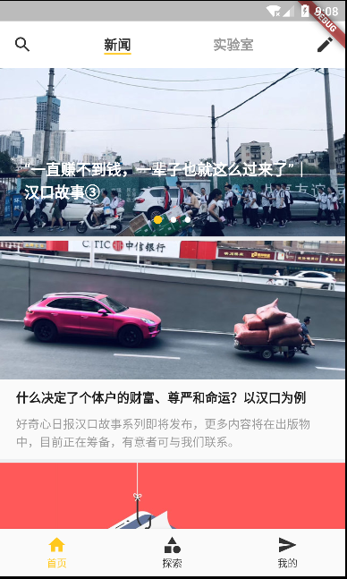
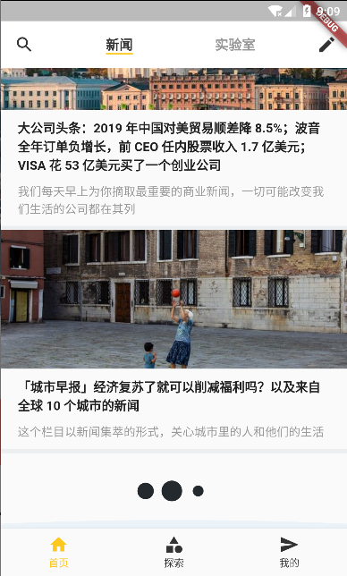
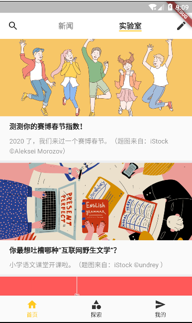
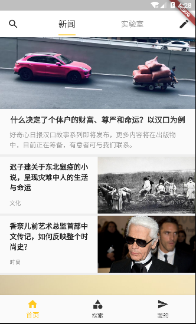

# 项目










> 底部图标： home category send
>
> 首页顶部：search mode_edit 
>
> 主题色：ffc81f


```dart
var onGenerateRoute = (RouteSettings setting) {
  print('$setting-----');
  // 统一处理传参
  final String name = setting.name;
  final Function pageContentBuilder = routes[name];

  if (pageContentBuilder != null) {
    if (setting.arguments != null) {
      final Route route = MaterialPageRoute(
        builder: (context) =>
            pageContentBuilder(context, arguments: setting.arguments),
      );
      return route;
    } else {
      final Route route = MaterialPageRoute(
        builder: (context) => pageContentBuilder(context),
      );
      return route;
    }
  }
}
```


> dio: ^3.0.0
>
>  flutter_swiper: ^1.1.4
>
>  flutter_spinkit: ^3.1.0


> 轮播图 ：height: 200


> http://app3.qdaily.com/app3/homes/index_v2/0.json
>
> http://app3.qdaily.com/app3/papers/index/0.json
>
> 


```dart
import 'package:flutter/material.dart';

class NoSplashFactory extends InteractiveInkFeatureFactory {
    const NoSplashFactory();

    InteractiveInkFeature create({
        @required MaterialInkController controller,
        @required RenderBox referenceBox,
        @required Offset position,
        @required Color color,
        TextDirection textDirection,
        bool containedInkWell: false,
        RectCallback rectCallback,
        BorderRadius borderRadius,
        ShapeBorder customBorder,
        double radius,
        VoidCallback onRemoved,
    }) {
        return new NoSplash(
            controller: controller,
            referenceBox: referenceBox,
            color: color,
            onRemoved: onRemoved,
        );
    }
}

class NoSplash extends InteractiveInkFeature {
    NoSplash({
        @required MaterialInkController controller,
        @required RenderBox referenceBox,
        Color color,
        VoidCallback onRemoved,
    }) : assert(controller != null),
                assert(referenceBox != null),
                super(controller: controller, referenceBox: referenceBox, onRemoved: onRemoved) {
        controller.addInkFeature(this);
    }
    @override
    void paintFeature(Canvas canvas, Matrix4 transform) { }
}
```

